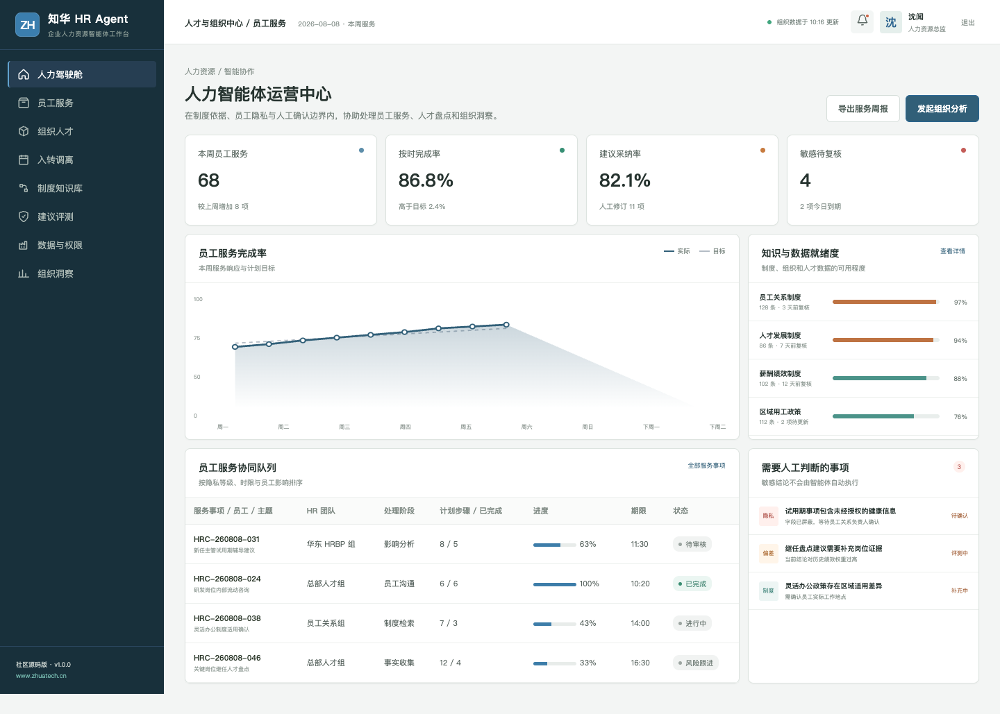
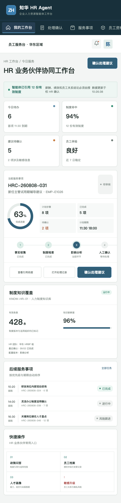

# HrAgent · 知华科技人力资源智能体

> 把制度依据、员工体验和人工判断放在同一条服务链路里。
>
> [知华科技（上海如静知华信息科技有限公司）官网](https://www.zhuatech.cn/) · 企业 AI 转型、Agent 定制、私有化部署与软件项目外包

面向 HRBP、员工关系、人才发展与共享服务团队的 AI Agent 社区源码项目。系统协助整理员工事项、检索制度、提示隐私与偏差风险，并把所有敏感人事决定留给授权人员。

## 人事判断的边界

智能体只做“事实整理—制度检索—影响分析—建议草稿”。涉及员工权益的决定必须经过授权 HR 与相应负责人确认，系统保留引用、修订和审批记录。

## 产品界面

人力智能体运营中心提供跨团队任务、风险、建议评测和数据工具的运营视角。

HR 业务伙伴协同工作台面向一线业务角色，保留证据、建议、人工确认和结果回写的完整链路。

## 主要能力

- 员工政策问答与条款级引用
- 入转调离服务事项协同
- 人才盘点与发展建议草稿
- 员工隐私字段级控制
- 偏差与公平性评测
- 录用、晋升、调薪、淘汰人工决策门禁

## 工程实现

| 层次 | 技术与职责 |
| --- | --- |
| H5 / Web | Vue 3、Pinia、Vue Router、Axios、Vite，响应式适配桌面与移动端 |
| Java API | Java 21、Spring Boot、Spring Security、JWT、JPA、Bean Validation |
| Agent 边界 | AgentRuntime 可替换，默认只运行本地演示，不调用真实模型或业务系统 |
| 领域策略 | EmployeeCaseTriageService 提供可测试、可解释的业务安全规则 |
| 数据 | MySQL 8、Flyway；测试环境使用 H2 |
| 交付 | Docker Compose、Nginx、CI、API、架构、数据库和部署文档 |

根据政策引用、证据数量、敏感信息和是否涉及人事决定给出透明风险分数，任何高风险事项进入人工复核。

## 本地体验

仅查看演示界面：

~~~bash
cd frontend
npm install
npm run dev:demo
~~~

访问 http://localhost:5173。管理端使用 **planner / Demo@2026**，业务协同端使用 **operator / Demo@2026**。

完整部署参数见 [deploy/README.md](deploy/README.md)，接口见 [docs/api.md](docs/api.md)，架构边界见 [docs/architecture.md](docs/architecture.md)。

## 使用许可与商业授权

本工程采用知华科技社区源码许可，**仅限个人学习、研究和非商业技术交流，不得商用**。企业内部使用、生产部署、项目交付、SaaS、收费服务、二次销售、品牌替换或其他商业用途，必须事先取得上海如静知华信息科技有限公司书面授权。完整条款以 [LICENSE](LICENSE) 为准。

深度定制、私有化部署、商业授权、AI Agent 咨询和软件项目外包，可访问[知华科技官网](https://www.zhuatech.cn/)或扫码咨询。

| 商务与技术咨询 | 项目合作咨询 |
| --- | --- |
|  |  |

SEO 关键词：HR Agent,人力资源智能体,员工服务 AI,HRBP 助手,人才盘点 Agent,Java Vue AI 项目，知华科技，上海如静知华信息科技有限公司。

## 企业级员工案件决策治理

新增 `POST /api/enterprise/hragent/employee-case-decision-release`，覆盖制度、权限、公平性、证据、人工决策、高风险复核、告知与申诉，返回 `RELEASE / HR_REVIEW / BLOCKED`。详见 [案件决策说明](docs/ENTERPRISE_CASE_DECISION.md)。
